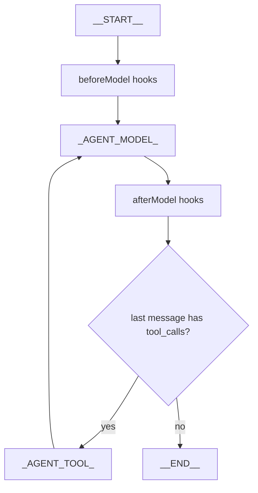
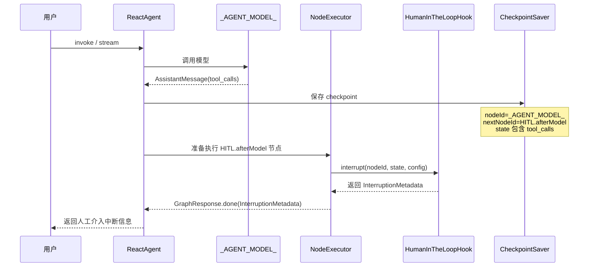
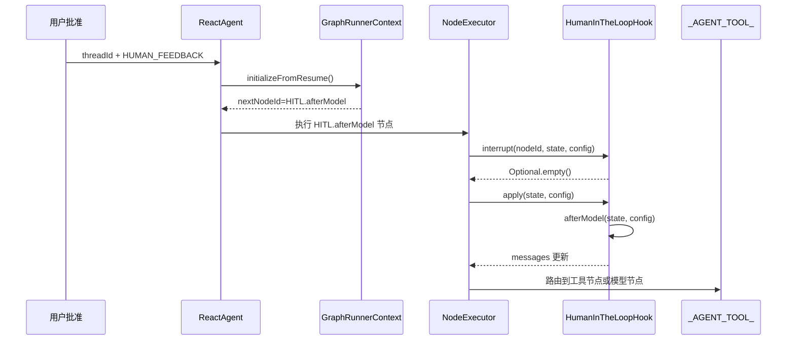
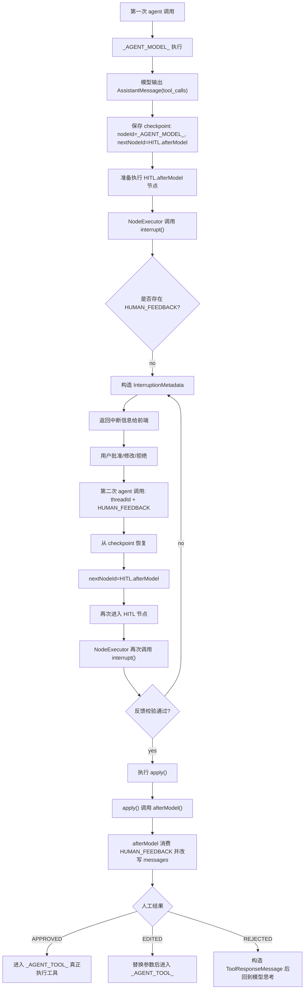

# Spring AI Alibaba Agent 人工介入 HITL 流程详解

本文整理 `Spring AI Alibaba Agent` 中 `HumanInTheLoopHook` 的打断、人工批准、checkpoint 恢复和继续执行流程。

核心结论先放前面：

> HITL 的第一次打断不是发生在 `afterModel()` 里面，而是发生在 `HumanInTheLoopHook` 这个 after-model hook 节点真正执行之前。
>
> 第一次进入 HITL 节点时，`NodeExecutor` 会先调用 `interrupt()`。如果没有人工反馈，就直接返回 `InterruptionMetadata` 并中断，不会执行 `afterModel()`。
>
> 第二次带着 `HUMAN_FEEDBACK` 恢复后，框架从 checkpoint 中记录的 HITL 节点继续执行。此时 `interrupt()` 校验反馈通过，才会放行并执行 `afterModel()`。

## 关键类

### ReactAgent

`ReactAgent` 负责把 Agent 编译成一张图。

常见 ReAct Agent 的核心节点一般包括：

```text
_AGENT_MODEL_  模型思考/模型调用节点
_AGENT_TOOL_   工具执行节点
```

如果配置了 hook，`ReactAgent.initGraph()` 会把 hook 也注册成图节点。

例如 `HumanInTheLoopHook` 属于 `AFTER_MODEL` 类型的 hook，最终会被放到模型节点后面：

```text
_AGENT_MODEL_
  -> HITL.afterModel
  -> _AGENT_TOOL_
```

这里的 `HITL.afterModel` 不是普通方法调用，而是图中的一个节点。

### HumanInTheLoopHook

`HumanInTheLoopHook` 的类结构大概是：

```java
public class HumanInTheLoopHook
        extends ModelHook
        implements AsyncNodeActionWithConfig, InterruptableAction {

    @Override
    public CompletableFuture<Map<String, Object>> apply(OverAllState state, RunnableConfig config) {
        return afterModel(state, config);
    }

    @Override
    public Optional<InterruptionMetadata> interrupt(String nodeId, OverAllState state, RunnableConfig config) {
        // 判断当前模型消息里是否存在需要人工审批的 tool_call
    }

    @Override
    public CompletableFuture<Map<String, Object>> afterModel(OverAllState state, RunnableConfig config) {
        // 消费 HUMAN_FEEDBACK，并根据 approve/edit/reject 改写消息
    }
}
```

这说明它有两种身份：

```text
AsyncNodeActionWithConfig
  -> 它是图里的一个可执行节点
  -> 真正执行时调用 apply()
  -> apply() 内部调用 afterModel()

InterruptableAction
  -> 它是一个可中断节点
  -> 执行器会在节点执行前调用 interrupt()
```

所以 `afterModel()` 和 `interrupt()` 不是一个阶段。

## 图结构

一个简化后的执行图可以理解成：



配置 HITL 后，`AfterModel` 里会包含 `HumanInTheLoopHook` 节点：

```text
_AGENT_MODEL_
  -> HumanInTheLoopHook.afterModel
  -> _AGENT_TOOL_
```

但注意：节点名叫 afterModel，不代表一进来就执行 `afterModel()` 方法。

真正执行节点前，`NodeExecutor` 会先做中断检查。

## NodeExecutor 的核心执行逻辑

源码中的关键逻辑在 `NodeExecutor.executeNode()`。

简化后可以理解为：

```java
AsyncNodeActionWithConfig nodeAction = context.getNodeAction(currentNodeId);

if (nodeAction instanceof InterruptableAction interruptable) {
    Optional<InterruptionMetadata> interruption =
            interruptable.interrupt(currentNodeId, state, config);

    if (interruption.isPresent()) {
        return Flux.just(GraphResponse.done(interruption.get()));
    }
}

CompletableFuture<Map<String, Object>> result =
        nodeAction.apply(state, config);

return handleActionResult(context, result);
```

也就是：

```text
进入节点
  ↓
如果节点实现了 InterruptableAction
  ↓
先调用 interrupt()
  ↓
如果 interrupt() 返回 InterruptionMetadata
  ↓
直接中断返回
  ↓
不会执行 apply()
  ↓
也就不会执行 afterModel()
```

这就是 HITL 第一次打断时，你在 `afterModel()` 里看不到“返回中断消息”的原因。

中断消息不是 `afterModel()` 返回的，而是 `interrupt()` 返回的。

## 第一次调用流程

用户第一次发起请求时，执行过程大致如下：



详细拆开：

1. 用户发起请求。
2. `_AGENT_MODEL_` 节点调用模型。
3. 模型返回 `AssistantMessage`，其中包含 `tool_calls`。
4. 模型节点执行完成后，框架会保存 checkpoint。
5. checkpoint 记录当前节点已经完成，下一步应该进入 HITL after-model hook 节点。
6. 框架准备执行 `HumanInTheLoopHook` 节点。
7. 因为 `HumanInTheLoopHook` 实现了 `InterruptableAction`，`NodeExecutor` 会先调用 `interrupt()`。
8. `interrupt()` 发现当前最后一条模型消息里有需要审批的工具调用。
9. 此时 `RunnableConfig` 中没有 `HUMAN_FEEDBACK`。
10. `interrupt()` 构造并返回 `InterruptionMetadata`。
11. `NodeExecutor` 直接返回中断结果，不执行 `apply()`。
12. 因此第一次打断时不会进入 `afterModel()`。

## 第一次 checkpoint 保存了什么

模型节点执行完成后，框架保存 checkpoint。

可以理解为：

```text
checkpoint.nodeId     = _AGENT_MODEL_
checkpoint.nextNodeId = HumanInTheLoopHook.afterModel
checkpoint.state      = 当前 OverAllState
```

其中 `state` 里已经有模型输出的 `AssistantMessage(tool_calls)`。

这很重要。

因为第二次恢复时，框架不是重新跑模型节点，而是从 `nextNodeId` 指向的节点继续。

也就是：

```text
恢复后要执行的下一个节点 = HumanInTheLoopHook.afterModel
```

## InterruptionMetadata 的作用

第一次中断返回的 `InterruptionMetadata` 通常包含：

```text
nodeId
state
toolFeedbacks
```

其中 `toolFeedbacks` 里会包含需要人工审批的工具调用信息，例如：

```text
toolCall id
tool name
tool arguments
description
```

前端或后端拿到这些信息后，可以让用户选择：

```text
APPROVED  批准
EDITED    修改参数后批准
REJECTED  拒绝
```

用户操作完成后，需要把反馈重新放进第二次调用的 `RunnableConfig.metadata`。

常见写法：

```java
InterruptionMetadata approvalMetadata = InterruptionMetadata.builder()
        .nodeId(interruptionMetadata.node())
        .state(interruptionMetadata.state())
        .addToolFeedback(
                InterruptionMetadata.ToolFeedback.builder(toolFeedback)
                        .result(InterruptionMetadata.ToolFeedback.FeedbackResult.APPROVED)
                        .build()
        )
        .build();

RunnableConfig resumeConfig = RunnableConfig.builder()
        .threadId(threadId)
        .addMetadata(RunnableConfig.HUMAN_FEEDBACK_METADATA_KEY, approvalMetadata)
        .build();

agent.invokeAndGetOutput("", resumeConfig);
```

这里最关键的是：

```text
threadId
HUMAN_FEEDBACK
```

`threadId` 用来找到 checkpoint。

`HUMAN_FEEDBACK` 用来告诉 HITL：这次不是首次打断，而是带着人工审批结果回来继续执行。

## 第二次恢复流程

第二次调用时，通常传入：

```text
threadId
HUMAN_FEEDBACK
```

框架会在 `GraphRunnerContext.initializeFromResume()` 中加载 checkpoint。

简化逻辑：

```java
Checkpoint checkpoint = checkpointSaver.get(config).orElseThrow();

this.currentNodeId = null;
this.nextNodeId = checkpoint.getNextNodeId();
this.overallState = checkpoint.getState();
this.resumeFrom = checkpoint.getNodeId();
```

也就是恢复成：

```text
currentNodeId = null
nextNodeId    = HumanInTheLoopHook.afterModel
resumeFrom    = _AGENT_MODEL_
state         = 第一次模型节点结束后的状态
```

然后 `MainGraphExecutor` 会继续驱动图执行。



详细拆开：

1. 用户批准或拒绝工具调用。
2. 后端构造 `InterruptionMetadata.ToolFeedback`。
3. 后端用同一个 `threadId` 再次调用 agent。
4. `GraphRunnerContext` 根据 `threadId` 从 checkpoint saver 中读取 checkpoint。
5. checkpoint 中的 `nextNodeId` 是 HITL after-model hook 节点。
6. 框架继续执行 HITL 节点。
7. `NodeExecutor` 再次先调用 `interrupt()`。
8. 这次 `RunnableConfig` 中存在 `HUMAN_FEEDBACK`。
9. `interrupt()` 调用 `validateFeedback(...)` 校验反馈是否完整、是否和当前 tool_call 匹配。
10. 如果校验通过，`interrupt()` 返回 `Optional.empty()`。
11. `NodeExecutor` 放行，继续执行 `nodeAction.apply(...)`。
12. `HumanInTheLoopHook.apply(...)` 内部调用 `afterModel(...)`。
13. `afterModel(...)` 消费 `HUMAN_FEEDBACK` 并改写消息。
14. 后续图继续路由到工具节点或模型节点。

## 为什么第二次会触发 afterModel

这个问题的答案是：

> 因为第一次中断保存的 checkpoint 指向的下一节点就是 HITL after-model hook 节点。

第一次不是已经执行完 HITL 节点后中断，而是：

```text
准备执行 HITL 节点
  ↓
执行前 interrupt()
  ↓
发现需要人工介入
  ↓
中断
```

所以 HITL 节点本身还没有真正执行。

第二次恢复时：

```text
恢复到 HITL 节点
  ↓
执行前 interrupt()
  ↓
发现已有 HUMAN_FEEDBACK
  ↓
校验通过
  ↓
执行 apply()
  ↓
进入 afterModel()
```

这就是第二次会进入 `afterModel()` 的原因。

## interrupt 和 afterModel 的职责区别

### interrupt()

`interrupt()` 是节点执行前的拦截点。

在 HITL 中，它主要负责：

```text
判断最后一条 AssistantMessage 是否有 tool_calls
判断这些 tool_calls 是否需要人工审批
判断 RunnableConfig 中是否已有 HUMAN_FEEDBACK
没有反馈 -> 构造 InterruptionMetadata 并中断
有反馈 -> 校验反馈
反馈有效 -> 放行
反馈无效 -> 继续中断
```

简化逻辑：

```java
public Optional<InterruptionMetadata> interrupt(String nodeId, OverAllState state, RunnableConfig config) {
    AssistantMessage lastMessage = getLastAssistantMessage(state);

    if (lastMessage == null || !lastMessage.hasToolCalls()) {
        return Optional.empty();
    }

    Optional<Object> feedback = config.metadata("HUMAN_FEEDBACK");

    if (feedback.isPresent()) {
        boolean valid = validateFeedback((InterruptionMetadata) feedback.get(), lastMessage.getToolCalls());
        return valid ? Optional.empty() : buildInterruptionMetadata(state, lastMessage);
    }

    return buildInterruptionMetadata(state, lastMessage);
}
```

### afterModel()

`afterModel()` 是节点真正执行时的逻辑。

在 HITL 中，它主要负责：

```text
从 RunnableConfig 中取出 HUMAN_FEEDBACK
根据人工反馈改写当前 messages
APPROVED -> 保留 tool_call
EDITED   -> 替换 tool_call 参数
REJECTED -> 构造 ToolResponseMessage，告诉模型工具调用被拒绝
```

关键点：

```java
Optional<InterruptionMetadata> feedback =
        config.getMetadataAndRemove("HUMAN_FEEDBACK", new TypeRef<InterruptionMetadata>() {});
```

这里是 `getMetadataAndRemove`，说明 `HUMAN_FEEDBACK` 是一次性消费的。

`afterModel()` 不负责第一次打断，它负责第二次恢复后处理人工反馈。

## approve / edit / reject 的后续行为

### APPROVED

批准时，`afterModel()` 会保留原来的 tool call。

后续图路由到 `_AGENT_TOOL_`，工具节点会真正执行工具。

```text
人工批准
  ↓
保留 AssistantMessage(tool_calls)
  ↓
进入 _AGENT_TOOL_
  ↓
真正调用工具
```

### EDITED

修改参数后批准时，`afterModel()` 会用用户修改后的 arguments 构造新的 tool call。

```text
人工修改参数
  ↓
替换 tool_call.arguments
  ↓
进入 _AGENT_TOOL_
  ↓
用修改后的参数调用工具
```

### REJECTED

拒绝时，`afterModel()` 会构造一个 `ToolResponseMessage`。

这个 ToolResponse 会告诉模型：

```text
这个工具调用被人工拒绝了
拒绝原因是什么
下一步建议是什么
```

这样做是为了保持消息协议完整。

因为模型已经产生了 tool call，后面必须有对应的 tool response，哪怕这个 response 表示“工具被拒绝”。

```text
人工拒绝
  ↓
构造 ToolResponseMessage
  ↓
通常回到模型节点
  ↓
让模型基于拒绝原因重新思考
```

## checkpoint 与恢复位置

checkpoint 保存的位置非常关键。

框架在节点执行完成后会保存：

```text
当前节点 nodeId
下一节点 nextNodeId
当前状态 state
```

模型节点输出 tool call 后，保存的是：

```text
nodeId     = _AGENT_MODEL_
nextNodeId = HITL.afterModel
state      = messages 中包含 AssistantMessage(tool_calls)
```

所以第二次恢复时，框架知道：

```text
模型节点已经执行过了
不要重新调用模型
下一步继续执行 HITL.afterModel
```

这就是 checkpoint 的意义。

它保存的不是“整个请求重新开始”，而是“图执行到哪个节点、下一步应该去哪、当前状态是什么”。

## RunnableConfig 与 OverAllState 的关系

### RunnableConfig

`RunnableConfig` 可以理解成本次运行的外部配置。

它常见用途包括：

```text
threadId
checkpoint id
stream mode
metadata
本次运行需要携带的额外参数
```

HITL 的人工反馈就是通过 `RunnableConfig.metadata` 传入的：

```java
.addMetadata(RunnableConfig.HUMAN_FEEDBACK_METADATA_KEY, approvalMetadata)
```

### OverAllState

`OverAllState` 是图执行期间的内部状态。

它常见内容包括：

```text
messages
工具调用结果
节点输出
业务状态
hook 更新后的状态
```

可以简单理解为：

```text
RunnableConfig  主外：本次调用从外部传进来的运行参数
OverAllState    主内：Agent 图内部节点执行产生和维护的状态
```

`RunnableConfig.metadata` 不会自动变成 `OverAllState`。

如果某个 hook 或节点想把外部 metadata 写入内部状态，需要在节点返回的 `Map<String, Object>` 中显式更新。

## 完整时序总览



## 容易混淆的点

### 1. 不是模型输出后直接在 afterModel 里打断

更准确的说法是：

```text
模型输出后，图路由到 after-model hook 节点；
执行这个 hook 节点前，NodeExecutor 先调用 interrupt()；
interrupt() 决定是否中断。
```

### 2. 第一次中断时 afterModel 没执行

第一次没有人工反馈，所以 `interrupt()` 直接返回 `InterruptionMetadata`。

`NodeExecutor` 看到中断结果后直接返回，不会继续执行 `apply()`。

因此：

```text
第一次中断：执行 interrupt()
第一次中断：不执行 afterModel()
```

### 3. 第二次不是重新调用模型

第二次传入同一个 `threadId` 后，框架会从 checkpoint 恢复。

checkpoint 指向的是 HITL 节点，所以不会重新执行模型节点。

### 4. 第二次为什么能进 afterModel

因为这次 `RunnableConfig` 中有 `HUMAN_FEEDBACK`。

`interrupt()` 校验通过后返回 `Optional.empty()`，表示不打断。

于是 `NodeExecutor` 才继续执行：

```java
nodeAction.apply(state, config);
```

而 HITL 的 `apply()` 内部就是：

```java
return afterModel(state, config);
```

### 5. afterModel 消费反馈后会删除 metadata

`afterModel()` 用的是：

```java
config.getMetadataAndRemove("HUMAN_FEEDBACK", ...)
```

这表示人工反馈只应该被消费一次。

如果后面还有新的工具调用，需要新的 HITL 中断和新的人工反馈。

## 一句话总结

HITL 的核心流程是：

```text
模型产生 tool_call
  -> checkpoint 记录下一步进入 HITL
  -> HITL 节点执行前 interrupt() 发现没有反馈，返回中断
  -> 用户批准后用 threadId 恢复 checkpoint
  -> 再次进入 HITL 节点
  -> interrupt() 发现反馈有效，放行
  -> afterModel() 消费反馈并改写消息
  -> 图继续进入工具节点或模型节点
```

最关键的一句：

> 第一次中断发生在 HITL 节点执行前；第二次恢复后还是回到 HITL 节点，只是这次 `interrupt()` 放行，所以才真正执行 `afterModel()`。

## ToolContext 与 Agent 状态

`ToolContext` 是工具执行时传给工具的一份上下文。

它本身不是 `OverAllState`，也不是 `RunnableConfig`，而是一个包装了 `Map<String, Object>` 的轻量对象。

Spring AI 中的 `ToolContext` 大概是：

```java
public final class ToolContext {

    private final Map<String, Object> context;

    public ToolContext(Map<String, Object> context) {
        this.context = Collections.unmodifiableMap(context);
    }

    public Map<String, Object> getContext() {
        return context;
    }
}
```

所以可以简单理解为：

```text
ToolContext
  -> 工具调用期间的上下文容器
  -> 内部是 Map<String, Object>
  -> 工具通过它读取额外信息
```

### 三者关系

```text
OverAllState
  Agent 图内部状态
  保存 messages、工具结果、业务状态
  checkpoint 会保存它

RunnableConfig
  本次运行的外部配置
  保存 threadId、metadata、HUMAN_FEEDBACK 等

ToolContext.context
  工具执行时临时传入的上下文 Map
  里面可以放 RunnableConfig.metadata
  也可以放 OverAllState、RunnableConfig、状态更新 Map
```

它们不是同一个东西，但 Agent 工具节点会把 `OverAllState` 和 `RunnableConfig` 放进 `ToolContext.context`，让工具执行时可以访问。

### 源码链路

工具调用链路可以按下面顺序追：

```text
AgentToolNode.apply(state, config)
  -> executeToolCallsSequential / executeToolCallsParallel
  -> executeToolCallWithInterceptors(...)
  -> 构造 ToolCallRequest
  -> lambda$executeToolCallWithInterceptors$4(...)
  -> 合并 toolContext、request context、state/config/updateMap
  -> executeToolByType(...)
  -> executeSyncTool / executeAsyncTool
  -> new ToolContext(context)
  -> toolCallback.call(arguments, toolContext)
```

入口在：

```java
AgentToolNode.apply(OverAllState state, RunnableConfig config)
```

工具节点一开始会从 `OverAllState` 中取消息：

```java
state.value("messages").orElseThrow();
```

然后取最后一条 `AssistantMessage` 的工具调用：

```java
assistantMessage.getToolCalls();
```

之后每个工具调用都会进入：

```java
executeToolCallWithInterceptors(toolCall, state, config, toolUpdateMap, parallel);
```

这里的 `toolUpdateMap` 是当前工具用来回写 Agent 状态的 Map。

### RunnableConfig.metadata 如何进入 ToolContext

在 `executeToolCallWithInterceptors(...)` 中，框架会构造 `ToolCallRequest`：

```java
ToolCallRequest.builder()
    .toolCall(toolCall)
    .context(config.metadata().orElse(new HashMap<>()))
    .executionContext(new ToolCallExecutionContext(config, state))
    .build();
```

这说明：

```text
RunnableConfig.metadata
  -> ToolCallRequest.context
```

也就是你通过 `RunnableConfig.addMetadata(...)` 传入的外部参数，会先进入 `ToolCallRequest.context`。

### Agent 状态如何进入 ToolContext

真正调用工具前，`AgentToolNode` 会组装 `context`：

```java
Map<String, Object> context = new HashMap<>(this.toolContext);
context.putAll(toolCallRequest.getContext());
```

然后对于常见工具类型，会继续加入 Agent 内部对象：

```java
context.putAll(Map.of(
    "_AGENT_STATE_", state,
    "_AGENT_CONFIG_", config,
    "_AGENT_STATE_FOR_UPDATE_", toolUpdateMap
));
```

这三个 key 的含义是：

```text
_AGENT_STATE_
  当前 OverAllState，只建议读取

_AGENT_CONFIG_
  当前 RunnableConfig，可读取 threadId、metadata 等

_AGENT_STATE_FOR_UPDATE_
  当前工具用于回写状态的 Map
```

最后才真正创建 `ToolContext`：

```java
ToolContext toolContext = new ToolContext(context);
toolCallback.call(arguments, toolContext);
```

所以最终关系是：

```text
RunnableConfig.metadata
  -> ToolCallRequest.context
  -> ToolContext.context

OverAllState
  -> _AGENT_STATE_
  -> ToolContext.context

RunnableConfig
  -> _AGENT_CONFIG_
  -> ToolContext.context

toolUpdateMap
  -> _AGENT_STATE_FOR_UPDATE_
  -> ToolContext.context
```

### 工具中如何读取

Alibaba 提供了 `ToolContextHelper`，不用自己手动写 key。

```java
public String myTool(String args, ToolContext toolContext) {
    OverAllState state = ToolContextHelper.getState(toolContext).orElse(null);
    RunnableConfig config = ToolContextHelper.getConfig(toolContext).orElse(null);

    Map<String, Object> update = ToolContextHelper
            .getStateForUpdate(toolContext)
            .orElseThrow();

    update.put("some_key", "some_value");

    return "工具执行结果";
}
```

推荐方式：

```text
读取当前状态
  用 ToolContextHelper.getState(toolContext)

读取当前运行配置
  用 ToolContextHelper.getConfig(toolContext)

更新 Agent 状态
  用 ToolContextHelper.getStateForUpdate(toolContext)
```

不要直接修改 `OverAllState`。

更合理的做法是把更新写入 `_AGENT_STATE_FOR_UPDATE_` 对应的 Map。

工具执行结束后，`AgentToolNode` 会把这些更新作为节点输出返回，后续再由图执行器合并进 `OverAllState`。

简化流程是：

```text
工具写入 stateUpdateMap
  -> AgentToolNode 返回 result.putAll(stateUpdates)
  -> NodeExecutor mergeIntoCurrentState(...)
  -> OverAllState 更新
  -> checkpoint 保存新的状态
```

### 小结

`ToolContext.context` 是工具执行时的临时上下文容器。

它可以带三类信息：

```text
外部传入信息
  RunnableConfig.metadata

Agent 当前状态
  _AGENT_STATE_ -> OverAllState

Agent 状态更新入口
  _AGENT_STATE_FOR_UPDATE_ -> Map<String, Object>
```

一句话记忆：

> `OverAllState` 是 Agent 内部状态，`RunnableConfig` 是本次运行配置，`ToolContext.context` 是工具调用时拿到的上下文 Map；框架会把前两者和状态更新 Map 放进这个 Map，让工具既能读取当前状态，也能把更新交回给 Agent。
